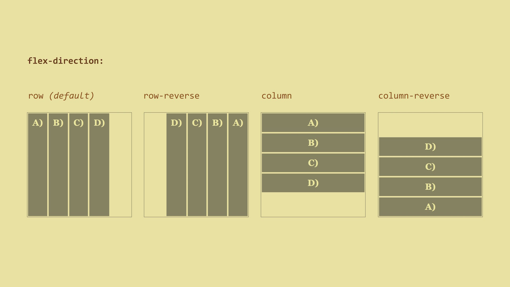
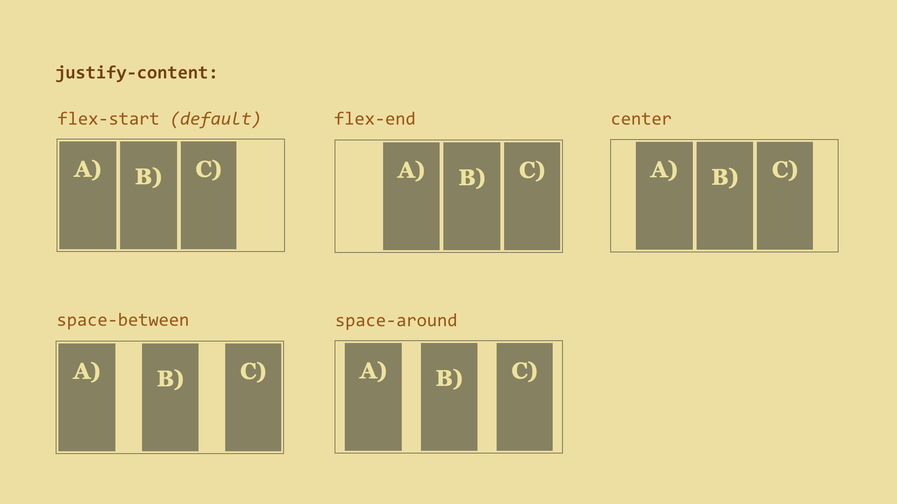
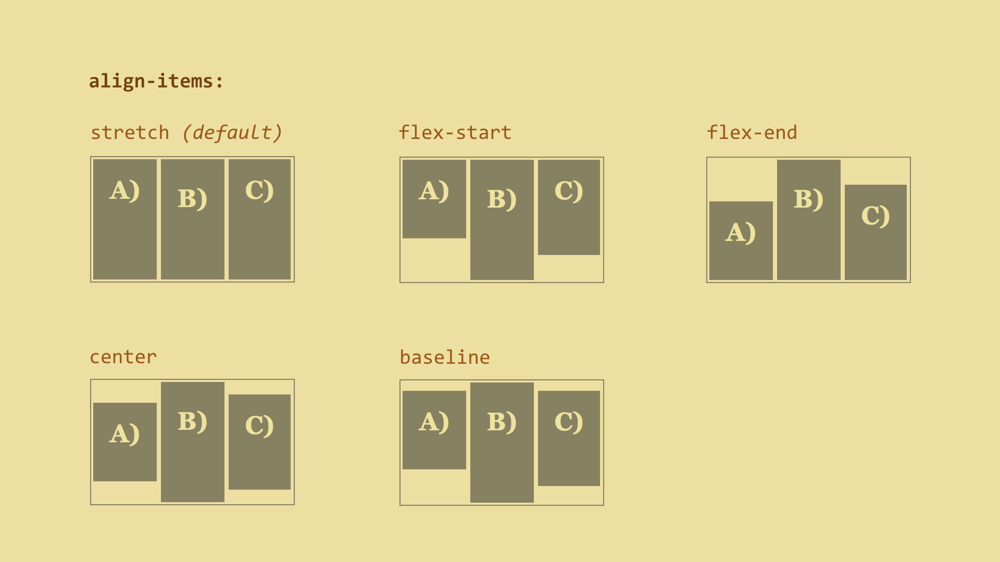
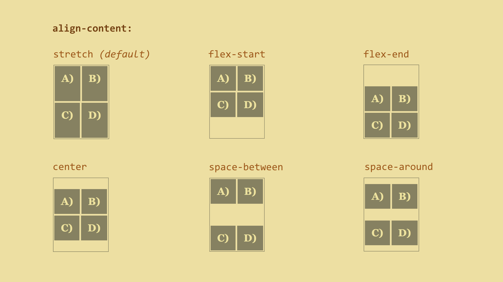

# Flex Container Properties

## Block or Inline?

Besides `display: flex` flexbox container can be defined as an inline element -` display: inline-flex`. In both cases, all direct descendants become flexbox items.

## Flex Direction – Direction of Flexible Items

This property will set the direction of the main flexbox axis.

```css
flex-direction:
  row | row-reverse | 
  column | column-reverse
```



The default (`row`) value will place all flex items in a row. If you want to
make a vertically oriented layout, use the `column` value.

The order of items will correspond to the HTML order. If you want to reverse the
order, just use the `row-reverse` or `column-reverse` values. This will only
affect the visual rendering of the items, not the actual order - i.e., when
rendering a site or going through the navigation using tab key. Some of you might
have noticed that we can use this property to change the order of list items.

## Flex Wrap – Forcing Items to Break

```css
flex-wrap:
  nowrap | wrap | wrap-reverse
```


The default `nowrap` value tells us that all elements will stay on a single line
next to each other (or under each other when using `flex-direction: column`).

Then we have the `wrap` value. This value will wrap the items onto multiple
lines if the items’ content can’t fit onto a single line. The last flex item on
the first line will break onto the next line and align under the first item.

The `wrap-reverse` value does the opposite - the last item will jump onto the
previous line and align over the first item.

Live demo: [http://cdpn.io/e/mERZxB](http://cdpn.io/e/mERZxB)

## Flex Flow - A Shorthand for Flex-direction and Flex-wrap

Let’s explain this in examples:

-   `flex-flow: row` – this is the default value. Items are placed in a single
    line and do not break.
-   `flex-flow: column wrap` – items are placed in a column and break.

We have explained the flex container properties. Now, let’s explain flex items
as there is more to explain.

## Justify Content – Aligning Main Axis Items

```css
justify-content:
  flex-start | flex-end | center |
  space-between | space-around
```



Let’s apply the `justify-content` property to the flex container, dictating how
flex items will be aligned along the main axis. The default value is
`flex-start`, aligning the items to the start of the main axis.

Live demo: [http://cdpn.io/e/doGjaZ](http://cdpn.io/e/doGjaZ)

## Align Items – Aligning Cross Axis Items

```css
align-items:
  stretch | flex-start | flex-end |
  center | baseline
```



The `align-items` property can also be applied to the flex container. The
default value is `stretch` which stretches the item to the full width of the
cross axis.

Be careful, though! The `stretch` value will not work if the items size of the
cross-axis is defined. In other words, if `height` is set, it will not work.

Live demo: [http://cdpn.io/e/RNmvmr](http://cdpn.io/e/RNmvmr)

## Align Content – Aligning Main Axis Items Within a Multiple Line Container

```css
align-content:
  stretch | flex-start | flex-end |
  center | space-between | space-around
```



And here is another alignment property. This one applies only to flex containers
whose items are wrapped onto multiple lines.

Live demo: [http://cdpn.io/e/oXbMRo](http://cdpn.io/e/oXbMRo)

So, is all clear now? Ok, now let’s move on to browser support.
