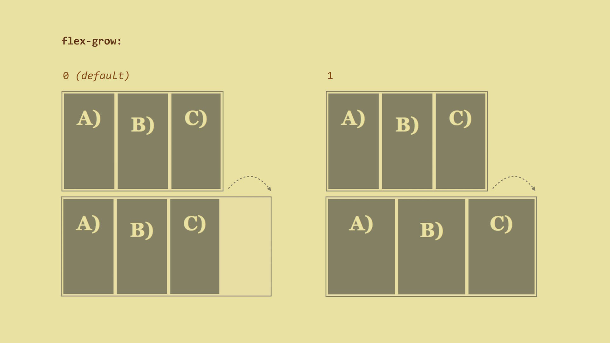
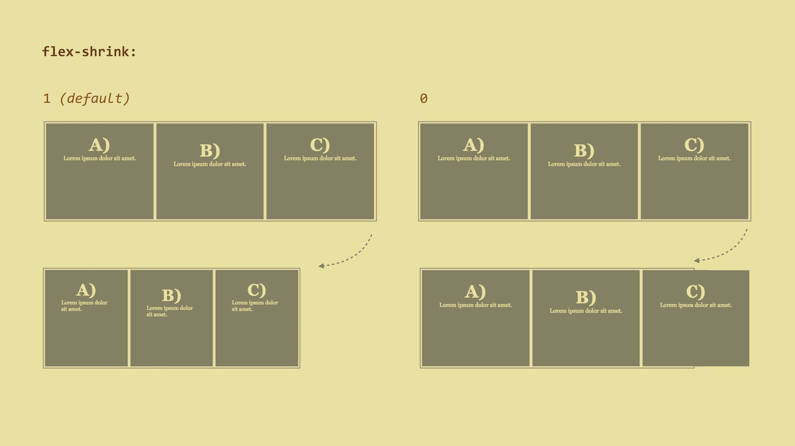
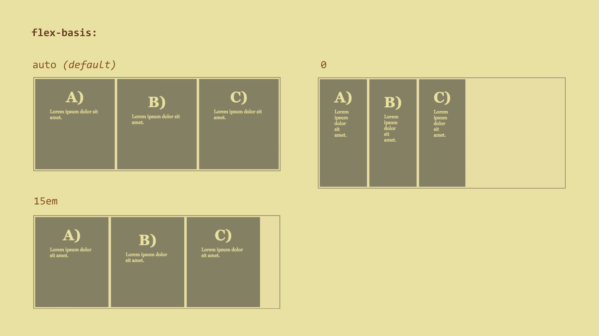
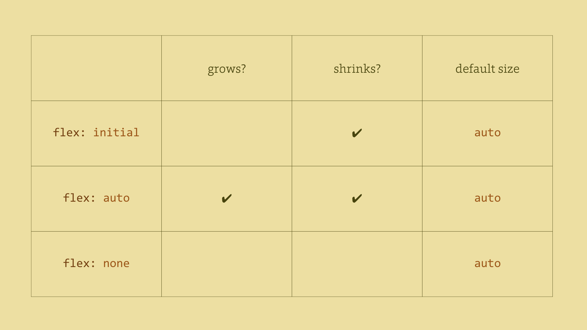

# Flex Item Properties

## `flex-grow` – The Ability To Grow {#flex-grow}

How much can the item grow relative to the rest of the flexible items when there
is free space? When a user resizes the browser window for example?  



The possible values:

- `0` (default), which means that items will not grow.
- Positive integers. The items will distribute across the newly gained space beyond their default width.

Live demo: [http://cdpn.io/e/GqrVzL](http://cdpn.io/e/GqrVzL)

## `flex-shrink` – The Ability To Shrink {#flex-shrink}

How much will the flex item shrink relative to other items when there is not
enough space in the parent element? When a user resizes the browser window or a
new item is added, for example. 



The possible values:

- `1` (default), which means that items will reduce their widths equally.
- Positive integers.

Live demo: [http://cdpn.io/e/PzWMvM](http://cdpn.io/e/PzWMvM)

## `flex-basis` – Default Item Size {#flex-basis}

This is the default width of the item (or default height when using
`flex-direction: column`).



-   `auto` (default) – the width is defined by the content, similar to `width:
    auto`. The distribution of free space using the `flex-grow/flex-basis`
    properties will then affect just the extra space that is taken up by items
    beyond their initial size - the so-called relative flex model.
-   `0` – size of the content is not an issue. The distribution of free space
    using the `flex-grow/flex-basis` properties will then affect the whole width
    of the item – the absolute flex model.
-   `100px`, `15em`, `50%` - or any other CSS size.

Live demo: [http://cdpn.io/e/oLZvgQ](http://cdpn.io/e/oLZvgQ)

## `flex` – Overall Item Flexibility {#flex}

This is a shorthand for all properties that define the flexibility of an item:
`flex-grow`, `flex-shrink` and `flex-basis`. It sets the default element size
and tells us how an element can grow and shrink.

It is good to know that the authors of the specification recommend using the
`flex` shorthand rather than the particular properties which it represents. This
is because the shorthand itself can set default values.

```css
flex:
  _flex-grow_ _flex-shrink_ _flex-basis_
```

The default value is:

```css
flex: 0 1 auto
```

-   `flex-grow: 0` - the item will not expand to fill free space.
-   `flex-shrink: 1` - it will shrink just as all other items.
-   `flex-basis: auto` - it will take up space defined by its own content.

Let’s assume you want your items to take up a minimum of `150px` and if there is
enough free space available, to expand equally. On the other hand, if there is
not enough free space, you want them to shrink equally. You will do it like
this:

```css
flex: 1 1 150px
```

However, I think you are better off using pre-defined “intelligent” values:



-   `flex: auto`
    This corresponds to `flex: 1 1 auto`. The items in question will become
    fully flexible, having a default width based on their contents. This is
    probably the most common case.
-   `flex: none`
    This corresponds to `flex: 0 0 auto`. It cancels the flexibility of the
    item. This is the second most common case.
-   `flex: initial`
    This resets values to the default, i.e. to `flex: 0 1 auto`. If there is not
    enough space, the items will shrink. However they will not expand beyond the
    size of their contents.
-   `flex: <positive-number>`
    Watch out if you use a single number here! The `flex: 1` declaration stands
    for `flex: 1 1 0` so the default size of the item and flex model will be
    changed. I have already mentioned this in the `flex-basis` property section.

It is also good to know that flex items will never shrink below their minimum
content size. This size is defined by the length of the longest word or
fixed-size element – e.g. an image. It can be changed by setting the `min-width`
or `min-height` properties to a low value.

## `order` – Changing the Order of Elements {#order}

The order of flex items corresponds to the HTML code. However, we can change
that using the `order` property.

A change in the order affects the visual position of an element rendered by a
browser. It does not affect the actual order of items, i.e. when using a
document reader or going through the navigation using the `Tab` key.

The default value is `0` which basically means that it will correspond to the
“actual HTML order”.

When using the following notation, you can make the third item visually appear
to be the first one:

```css
.flex-item-third {
  order: -1;
}
```

But remember that you can’t use `order` on other elements of the page except the
direct children of the flex container.

Live demo: [http://cdpn.io/e/JoqxJe](http://cdpn.io/e/JoqxJe)

## `margin` – Aligning Main Axis Items Within an Item {#margin}

The `margin: auto` declaration works similarly to block elements. When
calculating the size of flex items, the `auto` value does not matter. Free space
is equally distributed among all margins.

This allows you to set `margin-left: auto`, extending the left margin of an
element with left margin and pinning the item to the right. You can use this
instead of the `float` property.

All other “alignment properties” use similar values, however they apply to
different sets of flex items or different container axes.


## `align-self` – Aligning Cross Axis Items Within an Item {#align-self}

```css
align-self:
  auto | flex-start | flex-end |
  center | baseline | stretch
```

This property is applied to each item, so it is suitable for creating alignment
exceptions. The default value is `auto`.

Live demo: [http://cdpn.io/e/OXWKwe](http://cdpn.io/e/OXWKwe)

## Note: Baseline Alignment

Notice the alignment at the `baseline` of the first line. The item with the
greatest size between the baseline and the upper edge (the topmost one) will be
pinned to the upper edge of the flex container. You can see this in the previous
image or at [cdpn.io/e/QwobXz](http://cdpn.io/e/QwobXz).

Note that flexbox will not corrupt the upper pixel padding.

So, is all clear now? Ok, now let’s move on to browser support.
