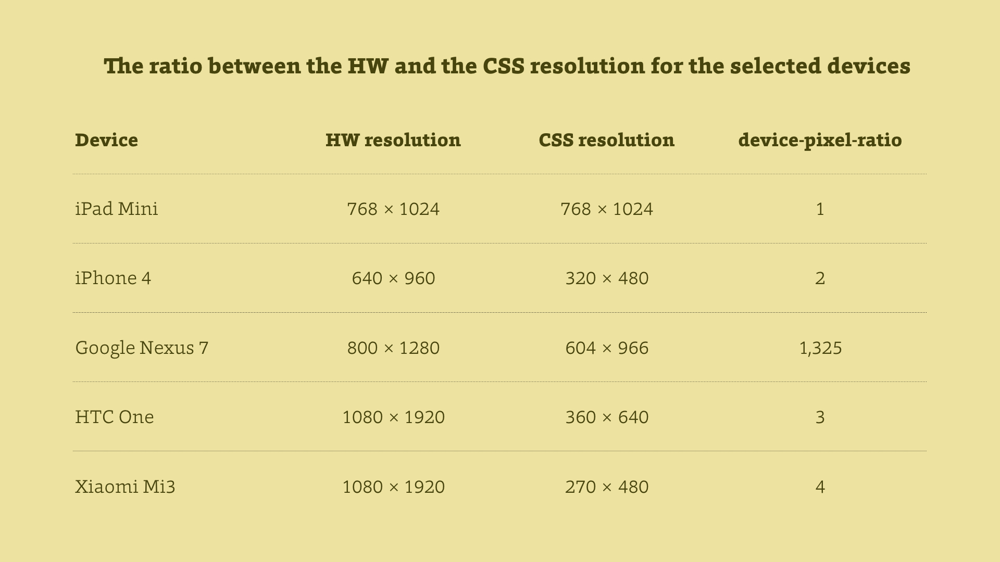

CSS Pixel Is Coming
===================

CSS pixel. Reference pixel. You may call it either way but a pixel is not what
it used to be when we were young.

Retina, Amoled, QuadHD… You may have noticed that mobile devices have crazy
resolutions. And the trend does not stop with mobile devices - take MacBook Pro
with Retina display for instance.

However, web designers do not have to worry about displaying their websites
using hardware resolutions. Browsers will calculate the resolution and display
it in a "CSS resolution".

For the ratio between hardware and CSS resolution, we use a technical term
`device-pixel-ratio` or a newer one: `resolution`. The latter one might be a
little confusing so for the sake of clarity, we will use the first term.

So what impact will the `device-pixel-ratio` have on UI designers? Let's find
out!
